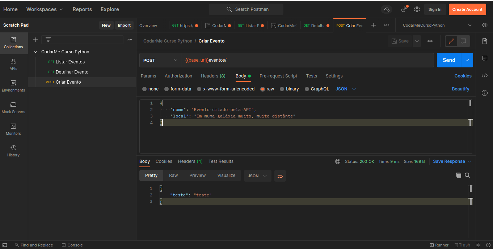

# Flask

## Introdução ao Flask

[Para saber mais sobre _Flask_](https://flask.palletsprojects.com/en/2.0.x/)

_Flask_ é um _microframework_ para desenvolvimento _web_.

Para inciarmos um projeto usando o _Flask_:

```bash
mkdir eventos-api
cd eventos-api
python -m venv venv
source venv/bin/activete
pip install Flask
```

Feito isso, criamos um arquivo `app.py`:

```py
from flask import Flask

app = Flask(__name__)

@app.route("/")
def index():
    return "<h1>Flask successfully installed!</h1>"
```

Quando criamos uma instância do _Flask_ precisamo informar um nome para essa aplicação. Para isso podemos usar a variável global do _python_ `__name__`, que se refere ao nome do próprio módulo que está sendo executado no momento.

para executar a aplicação:

`flask run --port=5500`

## Variáveis de ambiente do Flask

É importante ressaltar que o _Flask_ depende de duas variáveis de ambiente, a `FLASK_APP` e `FLASK_ENV`:

  * `FLASK_APP` serve para informar qual a nossa aplicação _python_ a ser executada dentro da _framework_ do _Flask_. No exemplo anterior executamos nossa aplicação sem precisar informar essa variável de ambiente, pois o arquivo `app.py` é interpretado como um ponto de entra para a aplicação que o _Flask_ deve executar, caso o nome do arquivo fosse `main.py` por exemplo, teriamos que executar informando para esse variável justamente esse arquivo, da seguinte maneira: `FLASK_APP=main.py flask run`.
  * `FLASK_ENV` serve para informar se nossa aplicação está sendo executada em produção ou desenvolvimento. Repare que ao executar o comando acima, o _Flask_ informa que estamos em ambiente de produção, e toda alteração que fazemos o arquivo, temos que parar o _Flask_ e executar novamente, passando para essa variável o ambiente como desenvolvimento, temos o _live reload_, assim o _Flask_ identifica as alterações automaticamente. `FLASK_APP=main.py FLASK_ENV=development flask run`.

## Listar eventos - Retornando dados de uma API

Para retornar dados em _JSON_, vamos usar o exemplo anterios dos eventos. Podemos criar uma rota para retornar os dados da seguinte forma:

```py
@app.route("/api/eventos/")
def listar_eventos():
    eventos_dict = []

    for ev in eventos:
        eventos_dict.append({
            "id": ev.id,
            "nome": ev.nome,
            "local": ev.local
        })

    return json.dumps(eventos_dict)
```

E nessa _url_ teremos o retorno com um `Content-Type: text/html; charset=utf-8`, mas na verdade quereremos que nossa _API_ retorne no formato _JSON_. Para isso podemos usar o `jsonify` do _Flask_ e alterar o nosso _return_ para:

```py
@app.route("/api/eventos/")
def listar_eventos():
    eventos_dict = []

    for ev in eventos:
        eventos_dict.append({
            "id": ev.id,
            "nome": ev.nome,
            "local": ev.local
        })

    return jsonify(eventos_dict)
```

Assim temos um `Content-Type: application/json` no _Response Headers_.

Agora note que no nosso _for_ estamos montando um dicionário declarando cada uma das propriedades. Podemos alterar isso, pois o _Python_ tem uma representação de dicionário padrão para objetos usando o `__dict__`. Dessa forma podemos refatorar nosso _for_ para:

```py
@app.route("/api/eventos/")
def listar_eventos():
    eventos_dict = []

    for ev in eventos:
        eventos_dict.append(ev.__dict__)

    return jsonify(eventos_dict)
```

## Detalhar evento

Vamos criar uma rota para acessar os detalher de um evento, para isso definos uma rota:

```py
@app.route("/api/eventos/<int:id>/")
def detalhar_evento(id):
    for ev in eventos:
       if ev.id == id:
           return jsonify(ev.__dict__)
```
Note que nessa rota temos essa sintaxe do _Flask_ `<int:id>`, que é um argumento que será informado na _URL_ do tipo inteiro e um nome, nesse caso `id`. E como temos esse parâmetro que é recebido pela _URL_, definimos uma função que irá receber esse parâmetro como argumento para assim detalhar os dados do evento com esse `id`.

Para esse exemplo refarotei para usar uma expressão _lambda_ apenas para aprendizem:

```py
find = lambda func, elements: next((element for element in elements if func(element)), None)
findall = lambda func, elements: [element for element in elements if func(element)]

@app.route("/api/eventos/<int:id>/")
def detalhar_evento(id):
    evento = find(lambda ev: ev.id == id, eventos)

    return jsonify(evento.__dict__)
```


[Para saber mais sobre _lambda_](https://docs.python.org/3.8/library/types.html?highlight=lambda#types.LambdaType)

## Lidando com erros no _Flask_

Note que ao tentar usar o nossa rota para detalhar um evento, se passarmos como argumento um `id` que não existe, causa um erro na nossa aplicação. Para isso precisamos tratar essa situação. Para isso podemos usar o `abort` da biblioteca _Flask_.

```py
@app.route("/api/eventos/<int:id>/")
def detalhar_evento(id):
    try:
        evento = find(lambda ev: ev.id == id, eventos)

        return jsonify(evento.__dict__)
    except AttributeError:
        abort(404, "Event Not Found!")
```

Nesse caso usei o _try/except_ do _Python_ para que quando houver o error que a página no retornou antes do tratamento de erros, retornar o _status_ 404 com uma mensagem mais amigável.

Também poderimos fazer da sequinte forma se usar o _try/except_:

```py
@app.route("/api/eventos/<int:id>/")
def detalhar_evento(id):
    for ev in eventos:
       if ev.id == id:
           return jsonify(ev.__dict__)

    abort(404, "Event Not Found!")
```

Agora para retornar esse erro como _JSON_ usamos o `make_response` do _Flask_:

```py
@app.route("/api/eventos/<int:id>/")
def detalhar_evento(id):
    try:
        evento = find(lambda ev: ev.id == id, eventos)

        return jsonify(evento.__dict__)
    except AttributeError:        
        data = { "error": f"Event id {id} not found!" }
        return make_response(jsonify(data), HTTPStatus.NOT_FOUND)
```

Mas para facilitar a manipulação de erros temos `@app.errorhandler`, pois da forma como foi feito acima teriamos de que tratar cadas uma das rotas caso não contrassemos um recurso.

Para utilizar o `@app.errorhandler`, informamos o qual o _status code_ e definimos uma função que será executada quando esse _status code_ ocorrer em algum dos _endpoints_:

```py
@app.errorhandler(404)
def not_found(error_msg):
    return (jsonify(error=str(error_msg)), HTTPStatus.NOT_FOUND)
```

Como definimos o `@app.errorhandler(404)` podemos deixas apenas o abort, pois o Flask cuida dessas execeções e quando for um erro 404 irá passar pela função que definimos em `@app.errorhandler(404)`:

```py
@app.route("/api/eventos/<int:id>/")
def detalhar_evento(id):
    try:
        evento = find(lambda ev: ev.id == id, eventos)

        return jsonify(evento.__dict__)
    except AttributeError:
        abort(404, "Event Not Found!")
```

[Para saber mais sobre manipulação de erros no _Flask_](https://flask.palletsprojects.com/en/2.0.x/errorhandling/)

## Criando um evento

Para crirar novos recursos, no nosso caso, evento em nossa _API_ precisamos criar uma rota que permita o metódo _POST_, para isso fazemos:

```py
@app.route("/api/eventos/", methods=["POST"])
def criar_evento():
    return jsonify(teste="teste")
```
Mas precisamos enviar dados para que nossa _API_ possa criar o novo evento. Usando o _Postman_ podemos fazer isso conforme a imagem abaixo:



E para que o _Flask_ possa pegar esses dados na requisição, vamos importar do _Flask_ o `request`. Usando o `request.data` podemos acessar os dados enviados pela rquisição e salvar em uma variável. E para retornar esses mesmos dados, apenas para teste, vamos usar o `json.loads` para retornar esses dados como _JOSN_. E podemos testar nosso _endpoint_ do _POST_:

```py
@app.route("/api/eventos/", methods=["POST"])
def criar_evento():
    data = json.loads(request.data)
    return data
```


Agora podemos extrair os valores passados pela requisição para criarmos o nosso novo evento.

Nesse caso vamos usar o `data.get("key")`, onde `key` é o nome da propriedade que quermos acessar. Também poderiamos fazer `data["key"]`, mas dessa forma se a requisição não enviar a `key` que estamos tentando acessar, nossa aplicação quebra. Utilizando o `data.get("key")`, caso tenha valor, será retornado o valor dessa `key`, caso contrário retornará `None`.

```py
@app.route("/api/eventos/", methods=["POST"])
def criar_evento():
    data = json.loads(request.data)
    nome = data.get("nome")
    local = data.get("local")

    if local:
        evento = Evento(nome=nome, local=local)
    else:
        evento = EventoOnline(nome=nome)
        
    eventos.append(evento)
    return data
```
Ao fazer essa requisição _POST_ iremos adicionar o novo evento na lista de eventos. Para conferir basta fazer uma requisição para a rota _GET_ para listar os eventos.

### Validação

Como a regra de negocio da nossa aplicação diz que o nome do evento não pode ser nulo, devemos fazer essa validação, para isso pode fazer:

```py
@app.route("/api/eventos/", methods=["POST"])
def criar_evento():
    data = json.loads(request.data)
    nome = data.get("nome")
    local = data.get("local")

    if not nome:
        abort(HTTPStatus.BAD_REQUEST, "Property 'nome' is required!")

    if local:
        evento = Evento(nome=nome, local=local)
    else:
        evento = EventoOnline(nome=nome)

    eventos.append(evento)
    
    return {
        "id": evento.id,
        "url": f"/api/eventos/{evento.id}"
    }
```
E também um novo `@app.errorhandler` para _Bad Request_, assim teremos dois manipulaores de erro:

```py
@app.errorhandler(HTTPStatus.NOT_FOUND)
def not_found(error_msg):
    return (jsonify(error=str(error_msg)), HTTPStatus.NOT_FOUND)

@app.errorhandler(HTTPStatus.BAD_REQUEST)
def not_found(error_msg):
    return (jsonify(error=str(error_msg)), HTTPStatus.BAD_REQUEST)
```