# Django

## Criando o projeto

Para iniciarmos nosso projeto _Django_, vamos criar um diretório e fazer as configuração iniciais do `venv` e instalar o _Django_:

```bash
mkdir projeto-eventos
cd projeto-eventos
python -m venv venv
source venv/bin/activate
pip install Django==4.0.3
```

Agora vamos criar um projeto _Django_ usando o comando:

```bash
django-admin startproject vamomarcar .
```

Assim iremos criar um projeto com o nome `vamomarcar` no diretório `.`, que é o atual.

Feito isso teremos um diretório com o nome do projeto e um arquivo `manage.py`.

Como isso já podemos rodar o nosso projeto pelo comando:

```bash
python manage.py runserver
```

## Criando nosso app

_Django_ é um _framework_ voltado para projetos grandes. Então ele tem dois conceitos difrentes quando você fala de projeto e uma aplicação. Dessa forma podemos ter em um projetos vários _apps_ ou funcionalidades divididas.

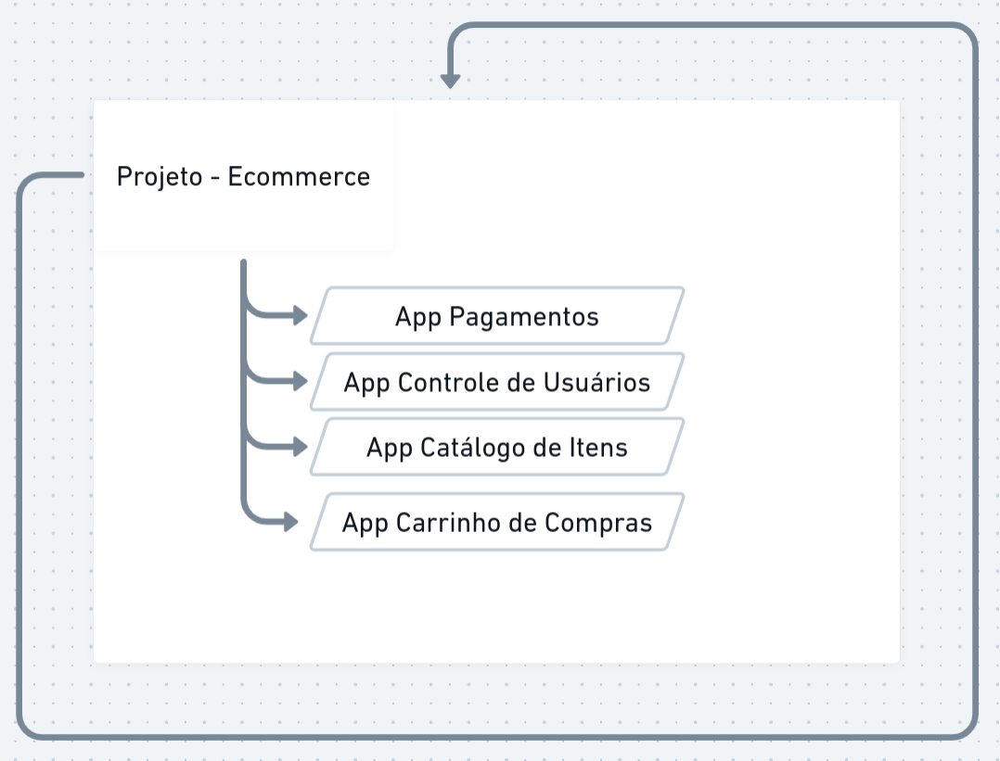

Dessa forma vamos começar a criar as funcionalidades ou _apps_ nesse nosso projeto. E para isso usamos a _CLI_ do _Django_:

```sh
django-admin startapp agenda
```

Feito isso teremos um novo diretório, `agenda`, criado na raiz do nosso projeto. Lembrando que o diretório `vamomarcar` é o diretório padrão do nosso projeto, onde contem arquivos, como por exemplo, `urls.py`, que contrala as rotas da nossa aplicação.

Como acabamos de criar nosso _app_ `agenda`, vamos criar uma _URL_ para ele, mas para isso precisamos criar uma _view_ para a `agenda`. No diretório da `agenda` no arquivo `veiws.py`:

```py
def index(request):
    return HttpResponse("Oláááá Enfermeira!")
```

Onde o `HttpResponse` é importado de `from django.http.response import HttpResponse`.

Aqui definimos uma função que recebe uma requisição e irá retornar uma resposta _HTTP_.

Agora podemos definir uma rota para a `agenda` no arquivo `urls.py`, onde:

```py
from django.contrib import admin
from django.urls import path

from agenda.views import index

urlpatterns = [
    path('admin/', admin.site.urls),
    path('', index),
]
```

Nesse caso, teremos que a rota raiz, irá chamar a função da nossa _view_ no caso a da `agenda`, pelo import que foi feito.

Note que o _Django_ já trouxe uma rota padrão para `admim`.

Uma boa prática no _Django_ é manter as _URLs_ de cada um dos _apps_ isoladas dentro daquela própria aplicação.

Para isso, vamos criar um arquivo `urls.py` no diretório `agenda`:

```py
from django.urls import path

from agenda.views import index

urlpatterns = [
    path('', index)
]
```

E agora no arquivo `urls.py` no diretório do projeto, `vamomarcar`, fazemos o include dessas _URLs_ da `agenda`:

```py
from django.contrib import admin
from django.urls import path
from django.urls.conf import include

from agenda.views import index
from agenda.urls import urlpatterns as agenda_urls

urlpatterns = [
    path('admin/', admin.site.urls),
    path('', include(agenda_urls))
]
```

## Exibindo Eventos

Para conseguirmos mostrar um evento, precisaremos definir um modelo(_model_), para a entidade evento. Note que no diretório `agenda`, temos um arquivo `models.py`, é nele que iremos definir os modelos de entidades que teremos na aplicação da agenda, vamos definir esse modelo e criar algumas instâncias:

```py
from django.db import models

# Create your models here.
class Evento:
    def __init__(self, nome, categoria, local=None, link=None):
        self.nome = nome
        self.categoria = categoria
        self.local = local
        self.link = link
        
aula_python = Evento("Aula de Python", "Back-end", "Sinop")
aula_js = Evento("Aula de Javascript", "Fullstack", link="https://rogovski.dev")

eventos = [
    aula_python,
    aula_js
]
```
E para que o usuário possa ver esses dados no navegador, vamos criar mais _view_ na aplicação da agenda:

```py
def exibir_evento(request):
    evento = eventos[0]
    
    return HttpResponse(f""""
        <html>
        <h1>Evento: {evento.nome}</h1>
        <p>Categoria: {evento.categoria}</p>
        <p>Local: {evento.local}</p>
        <p>Link: <a href='{evento.link} target='_blank'>Acessar</a></p>
        </html>
    """)
```
* Note que usamos `"""` três vezes, para abrir e fechar as _strings_, isso é chamado de _multiline strings_, assim podemos ter quebras de linhas no texto que o _Python_ identifica como parte do conteúdo. Além disso incluímos o `f` (_f strings_) para podermos fazer a interpolação do dados que queremos apresentar na _view_.
Feito isso, vamos nas _URLs_ da aplicação agenda para incluir o _path_ para essa _view_:

```py
from django.urls import path

from agenda.views import exibir_evento, index

urlpatterns = [
    path('', index),
    path('evento', exibir_evento)
]
```

## Utilizando _Django_ template

Não é uma boa prática mistrar o seu código _HTML_ com o seu código _python_. O idel é extrair isso para um arquivo separaddo. E para isso, no _Django_ usamos o _Django Templates_. Para fazer usso dos _templates_, vamos no diretório da nossa aplicação `agenda` e criamos a estrutra de diretórios `templates\agenda`.

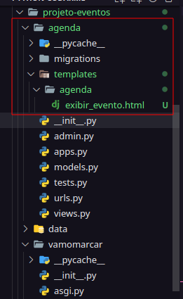

Agora vamos copiara a _string_ que declaramos anteriormente na `views.py` em `exibir_evento` e levar para o nosso _template_. E teremos que fazer alguns ajustes para que o _Django_ faça a interpolação das variáveis que passarmos para esse _template_, onde antes tinahmos as variáveis envolvidas por `{ evento.nome }`, agora temos `{{ evento.nome }}`, por exemplo:

```html
<html>
    <h1>Evento: {{ evento.nome }}</h1>
    <p>Categoria: {{ evento.categoria }}</p>
    <p>Local: {{ evento.local }}</p>
    <p>Link: <a href='{{ evento.link }}' target='_blank'>Acessar</a></p>
</html>
```
E agora passar informar para a nossa função `exibir_evento` utilizar esse arquivo _html_:

```py
def exibir_evento(request):
    evento = eventos[1]
    template = loader.get_template("agenda/exibir_evento.html")
    rendered_template = template.render(context={ "evento": evento }, request=request)
    
    return HttpResponse(rendered_template)
```

Perceba que tiver que fazer o _import_ `from django.template import loader` para utilizar uma função que carrega o _template_ que desejamos usar, `template = loader.get_template("agenda/exibir_evento.html")`.

Normalmente o _Django_ espera que dentro do diretório de cada aplicação, no nosso caso a `agenda` tenho um diretório `templates`, então para isso criamos um subdirtetório `agenda` para que o _Django_ saiba de qual aplicação ele deve buscar o _template_.

Na função `render`, informamos como parâmetros, o contexto que iremos passar para o template e a requisição. No caso do contexto é um objeto que tem uma propriedade justamente com o nome que é usado para fazer a interpolação.

Mas se tentar acessar essa rota agora, teremos um erro `TemplateDoesNotExist at /evento`, pois o _Django_ necessita de um configuração para informar quais aplicações estão instaladas. Isso é feito no arquivo `settings.py` no diretório do projeto `vamomarcar` e adidionamos a linha `'agenda.apps.AgendaConfig',`:

```py
INSTALLED_APPS = [
    'django.contrib.admin',
    'django.contrib.auth',
    'django.contrib.contenttypes',
    'django.contrib.sessions',
    'django.contrib.messages',
    'django.contrib.staticfiles',
    'agenda.apps.AgendaConfig',
]
```

`AgendaConfig` é uma classe que fica no arquivo `agenda/apps.py`:

```py
class AgendaConfig(AppConfig):
    default_auto_field = 'django.db.models.BigAutoField'
    name = 'agenda'
```
Esse fluxo acontece da seguinte forma:

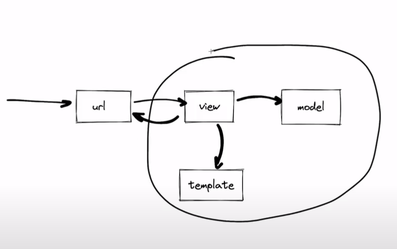

Por ser algo que aconte com frequência no _Django_ podemos os _shortcuts_ que vem do _import_ `from django.shortcuts import render` para reduzir o nosso código:

```py
def exibir_evento(request):
    evento = eventos[1]
    
    return render(request=request, context={ "evento": evento }, template_name="agenda/exibir_evento.html")
```
O _template engine_ do _Django_ também permite o usa de algumas lógicas simples de código. Por exemplo, se uma variável estiver sem valor(`None`, o `null` do _Python_), podemos tratar para mostar ou não essa informação:

```html
<html>
    <h1>Evento: {{ evento.nome }}</h1>
    <p>Categoria: {{ evento.categoria }}</p>
    <p>Local: {{ evento.local }}</p>
    <p>Link: <a href="{{ evento.link }}" target="_blank">Acessar</a></p>
</html>

```

[Para saber mais sobre _templates_.](https://docs.djangoproject.com/en/4.0/topics/templates/)

## _Django ORM_ e migrações

### Mapeando as entidades

Vamos começar usando o _sqlite_ como banco de dados e depois vamos migrar nossos dados para um _Postgres_. 

Perceba que na raiz do nosso projeto, temos um arquivo chamado `db.sqlite3`, que é onde o _sqlite_ irá salvar nossos dados.

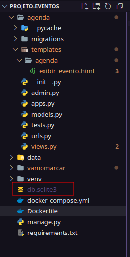

E para saber qual banco de dados nosso projeto, está usando, podemos ver isso em `vamomarcar/settings.py`:

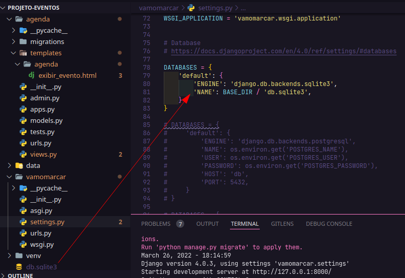

Para fazer a inserção de dados nesse banco de dados, poderiamos fazer isso de maneira manual. Mas o _Django ORM_ que faz o mapeamentos de nossas entidades e seus atributos.

Para isso precisamos refatorar um pouco o nosso código e fazer com que nossas classes herdem de `models.Model` do _Django_:

```py
class Categoria(models.Model):
    nome: models.CharField(max_length=256, unique=True)

class Evento(models.Model):
    nome = models.CharField(max_length=256)
    categoria = models.ForeignKey(Categoria, on_delete=models.SET_NULL, null=True)
    local = models.CharField(max_length=256, blank=True)
    link = models.CharField(max_length=256, blank=True)
```

Nessa refatoração, criamos uma nova entidade, a classe `Categoria` que herda de `models.Model`, assim como a `Evento`. Agora passamos a usar as funcionalidades do _Django ORM_ para mapear nossos atritubos, informandos os tipos deles e algumas propriedade como, o tamanho máximo, se esse campo é uma _PK_(_Primary Key_) do nosso banco de dados, assim não aceita registros duplicados, como no caso de `nome: models.CharField(max_length=256, unique=True)`.

E também fizemos um relacionamento de `Eventos` com `Categoria`, `categoria = models.ForeignKey(Categoria, on_delete=models.SET_NULL, null=True)`, informando quand a entidade é a `ForeignKey` e o que deve ser feito ao deletar um registro de `Categoria`, da qual `Evento` tenha um relacionamento. Assim ao deletar um registro em `Categoria` e o mesmo tenha uma relação como `Evento`, o valor passará a ser `null`, pois informamos que esse atributo pode ser `null` em `null=True`.

[Para saber mais sobre _models_.](https://docs.djangoproject.com/pt-br/4.0/topics/db/models/)

### Migrações

Todo processo de alteração em um banco de dados, é feito em duas etapas no _Django_, primeiro declaramos em código qual é a sua estrutura, as tabelas represntadas pelas entidades, e colunas representadas pelos atributos dessas entidades.

Feito os mapeados podemos usar as migrações(_Migrations_) do _Django_ para criar a tabelas em nosso banco de dados:

```sh
python manage.py makemigrations
```
Feito isso o _Django_ criará um arquivo em `agenda/migrations/0001_initiial_py`:

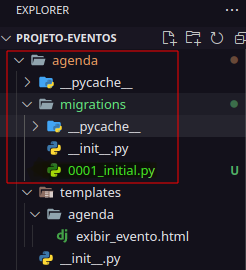

Esse arquivo é como a versão do nosso banco de dados. Que contém a estrutura das nossas mudanças no banco de dados. Conforme vamos fazendo alteraçõe no nosso banco de dados, o _Django_ gerar arquivos de migração de forma sequencial, de modo que mantemos um histórico das alterações que foram feitas no nosso banco de dados, também conseguirmos voltar no "tempo" para uma terminada "versão" que o banco de dados estava.

Depois de geradas essas mudanças, podemos aplicá-las em nosso banco de dados:

```sh
python manage.py migrate
```

Isso gera outras `migrations` que um projeto _Django_ também precisa, e junto delas está a nossa `migration`:


Feito isso, podemos conectar no nosso cliente de banco de dados por uma ferramenta do próprio _Django_:

```sh
python manage.py dbshell
```

Assim podemos inspecionar esse banco, como no caso é o _sqlite_, usamos o comando `.tables` para listar nossas tabelas:

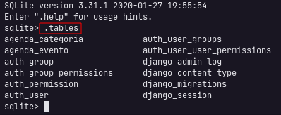

## Fazendo consultas pelo shell

Para acessar o _shell_ do _Django_, usamos:

```py
python manage.py shell
```

feito isso, acessaremos um terminal _python_:

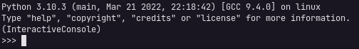

Do qual podemos criar registros de nossas entidades no banco de dados.

Importar as nossas entidades:

```py
from agenda.models import Evento, Categoria
```
Criar uma entidade no banco de dados:

```py
Categoria.objects.create(nome="Back-end")
```
Listar todas as entidades criadas:

```py
Categoria.objects.all()
```
Criar um registro no banco de dados e armazenar em uma variável:

```py
categoria = Categoria.objects.create(nome="Front-end")
```

Imprir o valor de uma propriedade da variável que foir armazenda:

```py
categoria.nome
```

Agora de se acessarmos o nosso cliente de banco de dados pelo comando:

```sh
python manage.py dbshell
```
E fizermos consultas em _SQL_ puro, podemos ver os registros criados:

```sh
.headers ON
select * from agenda_categoria;
```

A opção `.headers ON` habilita o nome das colunas das tabelas:

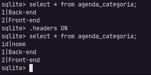

Ou melhor ainda, crie um arquivo em `~/.sqliterc`:

```sh
.mode column
.headers on
.separator ROW "\n"
.nullvalue NULL
.timer on
.changes on
```

Assim toda vez que acessar o _CLI_ do _sqlite_ o _output_ será um pouco _prettier_. 😁

Perceba então, que temos duas formas de fazer consulta ao nosso banco de dados, pelo _Django ORM_ ou pelo _dbshell_ que se conecta com o cliente do banco de dados.

Outro exemplo para persistir dados no nosso banco de dados usando o _Django ORM_ é criando novas intâncias e memória para depois persistir no banco de dados:

```sh
python manage.py shell
```
```py
from agenda.models import Evento, Categoria
categoria3 = Categoria(nome="Fullstack)
categoria3.save()
```

Como a nossa classe `Categoria` uma extensão de `models.Model`, ela herda vários atributos e métodos são herdados também. Um deles é o `save()`, que persiste no banco de dados a instância que criamos em memória.

Também podemos fazer consultas filtrando nossos valores, equivalente ao `where` do _SQL_:

```py
evento = Evento(nome="Aula de Django ORM", categoria="Back-end")
```

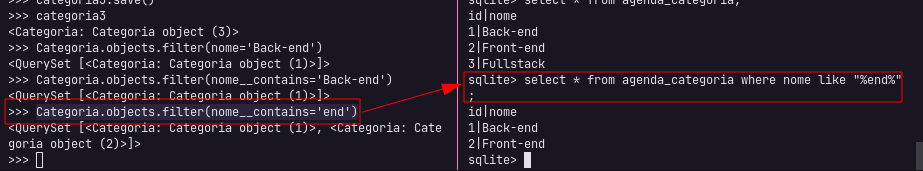

```py
Categoria.objects.filter(nome='Back-end')
Categoria.objects.filter(nome__contains='end')
```

```py
evento = Evento(nome="Aula de Django ORM", categoria="Back-end")
```
Note que tentar ciar um evento, com a categoria sendo uma `string`, teremos um erro, dizendo que `Evento.categoria` deve ser uma instância de `Categoria`.

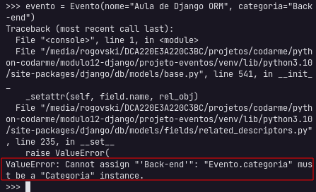

O correto é referenciarmos um instância de `Categoria` para `Evento.categoria`, para isso vamos buscar do banco de dados um categoria pelo seu `id` e para criar uma nova instância e usá-la para o novo evento:

```py
categoria_backend = Categoria.objects.get(id=1)
evento = Evento(nome="Aula de Django ORM", categoria=categoria_backend)
evento.save()
```
Lembrando que o atribuito `id` é herdado de `models.Model`.

Agora podemos acessar também atributos de uma entidade que é referenciada em outra:

```py
evento.categoria.nome
```
E também fazermos consultar mais personalizadas:

```py
Evento.objects.filter(categoria=categoria_backend)
Evento.objects.filter(categoria__nome="Back-end")
```

[Para saber mais sobre _queries_](https://docs.djangoproject.com/pt-br/4.0/topics/db/queries/)

## _Django Admin_

O _Django_ dispõe de um painel administrativo, chamdo _Django Admin_. Para utilizá-lo precisamos ir no diretório do nosso projeto  no arquivo `urls.py`e deixar o _path_ para a rota _admin_ habilitada:

```py
urlpatterns = [
    path('admin/', admin.site.urls),
    path('', include(agenda_urls))
]
```

Feito isso ao acessar http://localhost:8000/admin, iremos para uma tela de _login_. Porém ainda não temos um usuário e senha criados para acessar essa aplicação.

Para isso precisamos usar uma outra funcionalidade do `manage.py`, o `createsuperuser`:

```sh
python manage.py createsuperuser
```

Que ira solicitar o nome do usuário, endereço de e-mail e a senha. Caso seja uma senha fraca, o _Django_ solicita uma confirmação para continuar.

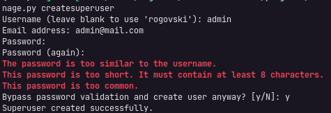

Feito isso podemos fazer o _log in_ para acessar o painel administrativo do _Django_.

Ao acessar veremos duas tabelas, que já são criadas por padrão em projetos _Django_, a `Groups` e `Users`.

Se clicarmos em `Users` temos os dados que existem nessa tabela. E o nosso usuário, que acabos de criar está lá, como _super user_ que pode ser conferido pela própriedade _STAFF STATUS_.

Para que nossas entites no _Admin_ precisamos registrar essas classes na administração do _Django_. Isso pode ser feito no diretório da nossa aplicação `agenda` no arquivo `admin.py`:

```py
from django.contrib import admin

from agenda.models import Categoria, Evento

# Register your models here.
admin.site.register(Evento)
admin.site.register(Categoria)
```

Agora ao atualizarmos o painel de administração teremos acesso a essas tabelas. Assim temos uma _CRUD_ para acessar nossos dados.

Note que algumas informações são apresentadas como `Evento object(1)` ou `Categoria object(1)`, por conta da método `__str__` que tentar converter nosso objeto para uma `string`, para isso podemos sobreescrever esse método para:

