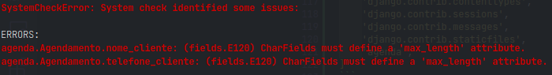
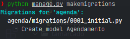
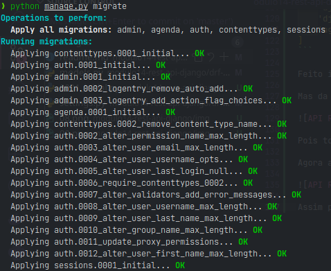

# REST API com Django Rest Framework

## O que é uma API REST

Nesse módulo vamos abordar sobre o _Django Rest Framework_ que é uma biblioteca que facilita a criação de _APIs REST_, ou melhor que seguem o padrão arquitetural _REST_. 

### O que é uma API

_API_ é um acrônimo para _Application Programming Interface_:

* Interface: Em _POO_ a interface representa um "contrato", uma função que é executada, podendo receber argumentos ou não, que pode retornar algo ou não. E sua implementação, sua lógica de negócio e feita por outra classe. Assim a _interface_ é uma função/método que pode ser disponibilizada para que outros executem essa funcionalidade, sem saber quais as regras de negócio são aplicadas ali.
* Application Programming: "Programação de aplicativos", mas faz mais sentido quando usado junto com a _Interface_, assim temos, "Interface de Programação de aplicativos", pois teremos aplicativos que irão usar as funcionalidades disponibilizadas por _interfaces_.

## HTTP API

Expõe uma _API_ através do protocolo HTTP:


## REST API

Acrônimo para _Representational State Transfer_, representação e manipulação de estado ou de recursos de uma aplicação.
  

### Padrões REST

* Uniform interface
* Stateless
* Cacheable
* Client-Server

#### Uniform Interface


#### Stateless


#### Cacheable


#### Client-Server


### HTTP != REST


### JSON != HTTP


## Configurando o nosso projeto

Agora vamos criar um novo projeto para usar o _Django Rest Framework_:

```sh
mkdir drf-api
cd drf-api
python -m venv venv
source venv/bin/activate
pip install Django
pip install djangorestframework 
django-admin startproject tamarcado .
django-admin startapp agenda
```

## Planejando a nossa API

### API

Endpoits para os recursos:

- Listar agendamentos: `GET /agendamentos/`
- Detalhar agendamento: `GET /agendamentos/<id>/`
- Criar agendamento: `POST /agendamentos/`
- Excluir agendamento: `DELETE /agendamentos/<id>/`
- Editar agendamento parcialmente `PATCH /agendamentos/<id>/`
- Listar horarios: `GET /horarios/?data=2022-03-01`

## Criando o modelo Agendamento

Para criar nosso primeiro modelo, `Agendamento`, vamos no nossa _App_ `agenda` e em `models.py`:

```py
class Agendamento(models.Model):
    data_horario = models.DateTimeField()
    nome_cliente = models.CharField()
    email_cliente = models.EmailField()
    telefone_cliente = models.CharField()
```

Lembrando que o nosso modelo herada de `models.Model` da classe `django.db`, pois ele vai ser um modelo criado no nosso banco de dados. E os atributos do nosso modelo serão tipos de `models`.

Feito vamos adicionar nosso _App_ `agenda` como uma aplicação instalada do nosso projeto, para isso, vamos em `tamarcado/settings.py` e em:

```py
INSTALLED_APPS = [
    'django.contrib.admin',
    'django.contrib.auth',
    'django.contrib.contenttypes',
    'django.contrib.sessions',
    'django.contrib.messages',
    'django.contrib.staticfiles',
]
```

Vamos adicionar `agenda`:

```py
INSTALLED_APPS = [
    'django.contrib.admin',
    'django.contrib.auth',
    'django.contrib.contenttypes',
    'django.contrib.sessions',
    'django.contrib.messages',
    'django.contrib.staticfiles',
    'agenda',
]
```

Feito isso, podemos tentar criar nossas _migrations_ com `python manage.py makemigrations`.

Mas da forma como definimos nosso modelo, temos o seguinte erro:



Pois todo atribuito do tipo `CharField()` precisamos declarar um `max_length`.

Agora ao criar nossas _migrations_ com `python manage.py makemigrations`.



Assim podemos executar nossas _migrations_ com `python manage.py migrate`:



Podemos criar agora a nossas _urls_ e _views_. Para isso precisaremos de um arquivo na nossa aplicação `agenda` chamado `urls.py` com o seguinte conteúdo:


```py
from django.urls import path
from agenda.views import agendamento_detail

urlpatterns = [
    # path('agendamentos/',agendamento_list),
    path('agendamentos/<int:id>/', agendamento_detail),
]
```

Por padrão o _Django Rest Framework_ sugere os nomes `resource_list`, obviamente para uma lista, e `resource_detail`, para detalhar um item da lista.

E incluir esse arquivo `agenda/urls.py`, no arquivo `tamarcado/urls.py`:

```py
from django.contrib import admin
from django.urls import include, path

urlpatterns = [
    path('admin/', admin.site.urls),
    path('api/', include('agenda.urls'))
]
```

E agora vamos criar nossas _views_ em `agenda/views.py`:

Que poderia ser algo do tipo:

```py
from django.shortcuts import render
from agenda.models import Agendamento

# Create your views here.
def agendamento_detail(request, id):
    try:
        agendamento = Agendamento.objects.get(id=id)
    except:
        raise('Mensagem de erro')
```

Mas o _Django_ já oferece a funcção `get_object_or_404` para isso.

```py
from django.shortcuts import get_object_or_404, render
from agenda.models import Agendamento

# Create your views here.
def agendamento_detail(request, id):
    agendamento = get_object_or_404(Agendamento.objects.get(id=id))
```

Assim podemos fazer o retorno desse objeto de forma serializada em _JSON_.

## Serialização de um Agendamento

O _Django Rest Framework_ oferece serializadores ou _serializers_. Para implementar, vamos criar o arquivo `agenda/serializers.py`

```py
from rest_framework import serializers

class AgendamentoSerializer(serializers.Serializer):
    data_horario = serializers.DateTimeField()
    nome_cliente = serializers.CharField(max_length=200)
    email_cliente = serializers.EmailField()
    telefone_cliente = serializers.CharField(max_length=20)
```

Nesse arquivo criamos uma classe que fará a serialização do nosso modelo `Agendamento` de um para um dos seus atributos.

Para fazer uso desse serializador, importamos em nossa `agenda/views.py`:

```py
from django.shortcuts import get_object_or_404, render
from agenda.models import Agendamento
from agenda.serializers import AgendamentoSerializer

# Create your views here.
def agendamento_detail(request, id):
    agendamento = get_object_or_404(Agendamento.objects.get(id=id))
    serializer = AgendamentoSerializer(agendamento)
```

E ao passarmos um instância de `Agendamento` para o construtor do `AgendamentoSerializer`, ele tentará criar encontrar, por padrão, ele vai tentar encontrar na instância passada os campos com nomes que declaramos em nosso serializador, por isso utilizamos os mesmos nomes que os atributos do nosso modelo.

Com isso podemos usar `serializer.data` que terá uma representação ainda em dicionário do _Python_. E fazer o retorno dos dados utilizando o `JsonResponse` do _Django_ que já indica no `header` setado como `application/json`:

```py
from django.http import JsonResponse
from django.shortcuts import get_object_or_404, render
from agenda.models import Agendamento
from agenda.serializers import AgendamentoSerializer

# Create your views here.
def agendamento_detail(request, id):
    agendamento = get_object_or_404(Agendamento, id=id)
    serializer = AgendamentoSerializer(agendamento)
    return JsonResponse(serializer.data)
```

Para testar podemos usar o _Django Admin_ ou o _shell_. Pelo _Django Admin_, precisamos antes registrar nosso modelo em `agenda/admin.py`:

```py
from django.contrib import admin

from agenda.models import Agendamento

# Register your models here.
admin.site.register(Agendamento)
```

E caso ainda não tenha criado o super usuário, execute:

```sh
python manage.py createsuperuser
```

Informe usuário, e-mail e senha.

Depois executer o servidor:

```sh
python manager.py runserver
```

E acessar `localhost:8000/admin` e fazer o _login_ com o usuário criado. Assim você poderá criar novos agendamentos.

Outra forma é pelo _shell do Django_, para isso execute:

```sh
python manager.py shell
```

Assim você terá acesso a _CLI_ do _Django_ e pode criar novas instâncias dos modelos que acabamos de criar, excecute os camandos:

```sh
python manager.py shell # para acessar o shell
from agenda.models import Agendamento # para fazer o import do nosso model
from datetime import datetime # para podemos atribuir a data_horario do agendamento
agendamento = Agendamento(data_horario=datetime.now(), nome_cliente="John Doe", email_cliente="johndoe@mail.com",telefone_cliente=99999999999) # para criar uma instância de agendamento
agendamento.save() # para persistir os dados na base de dados
``` 