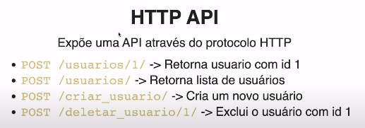
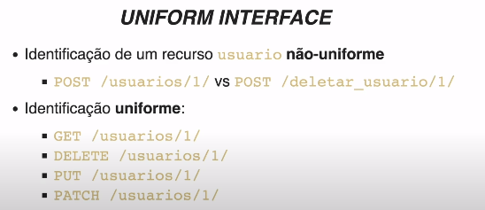
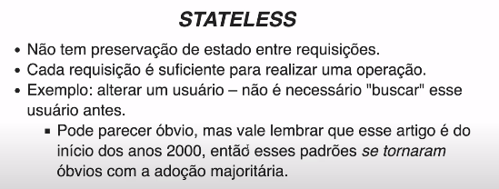
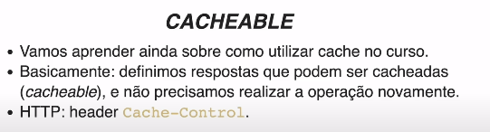
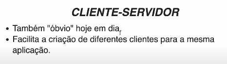
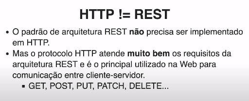
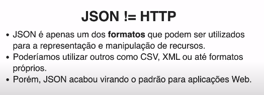

# REST API com Django Rest Framework

## O que é uma API REST

Nesse módulo vamos abordar sobre o _Django Rest Framework_ que é uma biblioteca que facilita a criação de _APIs REST_, ou melhor que seguem o padrão arquitetural _REST_. 

### O que é uma API

_API_ é um acrônimo para _Application Programming Interface_:

* Interface: Em _POO_ a interface representa um "contrato", uma função que é executada, podendo receber argumentos ou não, que pode retornar algo ou não. E sua implementação, sua lógica de negócio e feita por outra classe. Assim a _interface_ é uma função/método que pode ser disponibilizada para que outros executem essa funcionalidade, sem saber quais as regras de negócio são aplicadas ali.
* Application Programming: "Programação de aplicativos", mas faz mais sentido quando usado junto com a _Interface_, assim temos, "Interface de Programação de aplicativos", pois teremos aplicativos que irão usar as funcionalidades disponibilizadas por _interfaces_.

## HTTP API

Expõe uma _API_ através do protocolo HTTP:



## REST API

Acrônimo para _Representational State Transfer_, representação e manipulação de estado ou de recursos de uma aplicação.
  

### Padrões REST

* Uniform interface
* Stateless
* Cacheable
* Client-Server

#### Uniform Interface



#### Stateless



#### Cacheable



#### Client-Server



### HTTP != REST



### JSON != HTTP



## Configurando o nosso projeto

Agora vamos criar um novo projeto para usar o _Django Rest Framework_:

```sh
mkdir drf-api
cd drf-api
python -m venv venv
source venv/bin/activate
pip install Django
pip install djangorestframework 
django-admin startproject tamarcado .
django-admin startapp agenda
```